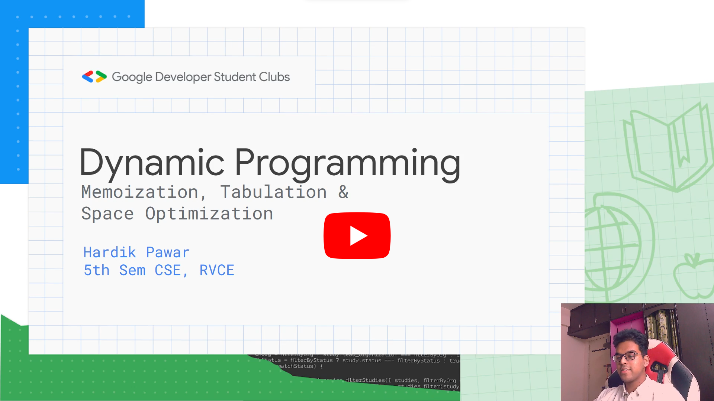

# Google Developer Student Clubs Session on Dynamic Programming

This repository contains the code & resources for the session on Dynamic Programming conducted by me for the Google Developer Student Clubs community, RVCE.

## Session Video

## Resources

- [Slides](./PPT/Dynamic%20Programming%20Session%20by%20Hardik%20Pawar.pdf)

## Code

- [Fibonacci](./1D_DP/1_fibonacci.cpp)
- [Frog Jump](./1D_DP/2_frog_jump.cpp)
- [House Robber](./1D_DP/3_house_robber.cpp)
- [Unique Paths](./2D_DP/1_unique_paths.cpp)
